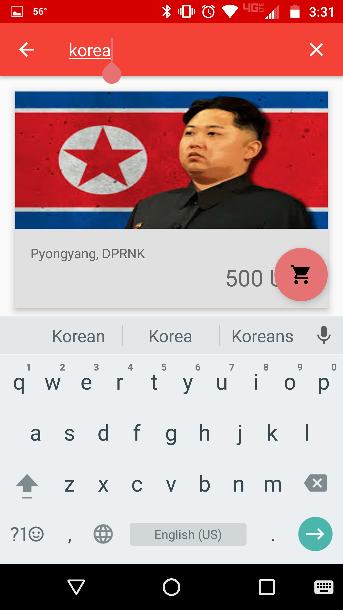
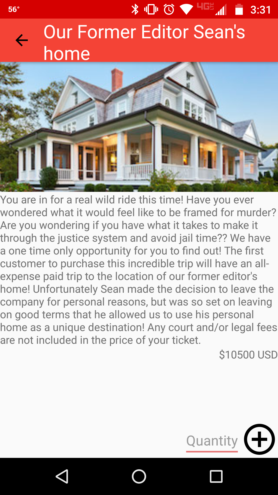

This app displays a list of vacation options that can be added to the cart and purchased. There isn't too much information about the company behind this app, but how bad can they possibly be?

Each item consists of a name, description, price, picture, and some keywords when displayed on the main screen. When in the shopping cart, an item only requires the name, a smaller thumbnail, and new variable for quantity.

The shopping cart displays all of the available items in the user's cart. Individual items can be removed, as well as the entire cart via checking out.

## Screenshots

   

